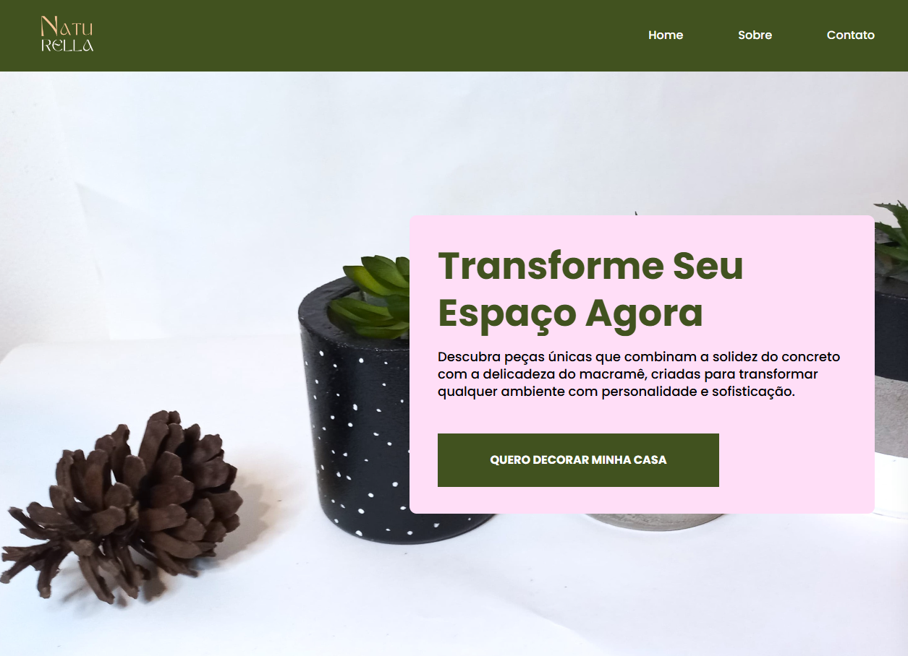

<h1 align="center">
  Naturella
</h1>



<div align="center">
  <a href="README-en.md">English</a>
  ·
  <a href="README.md">Português</a>
</div>

## 💬 Description

This is a store specialized in making handmade concrete pieces!

## 🚀 Technologies

### Front-end

- [NextJS](https://nextjs.org/) - Framework (based on the [ReactJS](https://react.dev/) library) used to build interfaces
- [TypeScript](https://www.typescriptlang.org/) - Set of packages that add static typing to the JavaScript language
- [Google Fonts](https://fonts.google.com/) - Library containing various fonts
- [Tailwind CSS](https://tailwindcss.com/) - CSS framework for styling
- [Lucide](https://lucide.dev/) - Icon library

#### Layout

You can view the project layout through [this link](https://www.figma.com/design/1YqDYZNa15z2YPHJxY6s6T/Naturella?node-id=201-2&t=HC0upy9HMpmHU7Wa-1).

## 🚀 Getting started

First of all you need to have `node` or `yarn` (or `npm`) installed on your machine.

*If you decide to use npm don't forget to delete `yarn.lock` in folders.*

Then you can clone the repository.

```code
  git clone https://github.com/zehguilherme/naturella
```

Start the application

1. `yarn` or `npm install`
2. `yarn dev` or `npm run dev`

## 🤔 How to contribute

1. Fork the project;
2. Create your feature branch `git checkout -b my-new-feature`;
3. Commit your changes: `git commit -m 'feat: Add some feature'`;
4. Push to the branch: `git push origin my-new-feature`;
5. Create a new Pull Request;
6. After the merge of your pull request is done, you can delete your branch.

---

Made with 💟 by José Guilherme Paro Monteiro Tomaine 👋 [Task to me!](https://www.linkedin.com/in/josé-guilherme-paro-monteiro-tomaine/)
